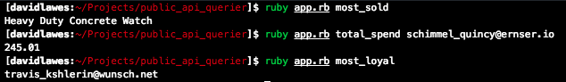

# public_api_querier

[](https://travis-ci.org/DaveLawes/public_api_querier)

This is a command line Ruby app that queries a public api and returns answers to three hard-coded questions. 

The app has been test-driven using RSpec and has 100% test coverage, no linter offences:


## How to Use

#### How to Install

The application was built using Ruby 2.5.1 and this Ruby version is specified as part of the build.

Clone this repo to your local machine. Run `bundle install` to make sure all gemfiles (dependencies) are correctly installed.

#### How to Test

From the root of the project directory run `rspec`. This will run all feature and unit tests.

Note: feature tests make calls to the API whereas the unit tests are isolated and stub any GET requests.

#### How to Run

From the root of the project directory invoke the following commands in the command line:

- To get an answer for the most sold question: `ruby app.rb most_sold`
- To get an answer for the total spend question: `ruby app.rb total_spend [EMAIL]`
- To get an answer for the most loyal question: `ruby app.rb most_loyal`



## Requirements

Requirements extracted from the provided instructions:
- Provide documentation about the design
- Explain my thought process
- Provide information about how to run and test my app
- Write simple and readable code
- Split the app across multiple files
- Provide meaningful (passing) tests
- Deal with edge cases as a bonus

## User Stories

The requirements above translated into the following user stories:

```
As a user
So I can provide more detailed information to my client
I'd like the app to return the most sold item

As a user
So I can provide more detailed information to my client
Given a user's email address, I'd like the app to return their total spend

As a user
So I can provide more detailed information to my client
I'd like the app to return the most loyal customer
```

Some identified edge cases:

```
As a user
So I get more information about the app
I'd like to receive feedback if an unknown question is asked

As a user
So I get more information about the question result
I'd like to receive feedback if the total_spend email isn't included in the data

As a user
So I get more information from the app
I'd like to receive feedback if there is an error with the HTTP response
```

## Domain Model

```
╔════════════╗  
║             ║ Instantiates an instance of the Question class
║   app.rb    ║ Invokes a method on Question based on what question was asked     
║             ║ Returns answer to user
╚════════════╝
       |
       |
       |
       |                (Class)
       |            ╔════════════╗
       |            ║             ║ Instantiates a new instance of the QueryApi class
       |------------║   Question  ║ Manipulates data received from API
                    ║             ║ Returns answer to app.rb
                    ╚════════════╝
                           |
                           |
                           |               (Class)              
                           |            ╔════════════╗     
                           |            ║             ║ Queries API  
                           |------------║  QueryApi   ║ Returns data to Question class
                                        ║             ║    
                                        ╚════════════╝ 
                                         
```

The main app file (app.rb) controls the actions; a case/switch structure determines what method should be invoked. This structure deals with some edge cases, such as an unknown question being asked.

The app.rb file instantiates a new instance of the Question class. Upon instantiation the Question class makes calls to the public API (for both purchases and users) and the data is assigned to instance variables. The Question class contains 3 public methods: one for each of the hard-coded questions. These public methods call upon private methods to sort and search through the data, finally returning the answer to app.rb.

The QueryApi class controls the HTTP requests and responses. For the current application only GET requests are made to the API. The class uses the Ruby gem 'net/http' to make HTTP GET requests and receive responses. The 'json' gem is used to enable the response body to be parsed into JSON format (that can then be manipulated within the Question class).

## Design Process

The following describes my steps when creating the solution:
- Read the requirements and ensure I have understood them
- Create user stories for core requirements and edge cases
- Create a domain model (having thought about what classes and architecture I want)
- Setup my project (github repo, TravisCI, rubocop, simplecov)
- Follow a red-green-refactor flow (starting with a feature test for my first user story)
- If edge cases are identified when working: add these as features/user stories to be completed after all core user stories have been satisfied
- When design is finished: update documentation

## Areas for Improvement

1. The app does not look at the API status, it assumes that the API status is always ok. To improve the quality of the results it would be good to add functionality to check the status before attempting to GET purchases/users. If the API status is not ok, then this information could be fed back to the user.
2. The app raises an error if the HTTP response is not successful. It does this by checking the class of the HTTP response. If the response class is anything other than 'Net::HTTPSuccess' then it raises an error. However, potentially valid responses could exist for redirections.
3. I've assumed that the 'users' data set will contain unique emails and ids only - the app isn't written to check these kinds of edge cases.
